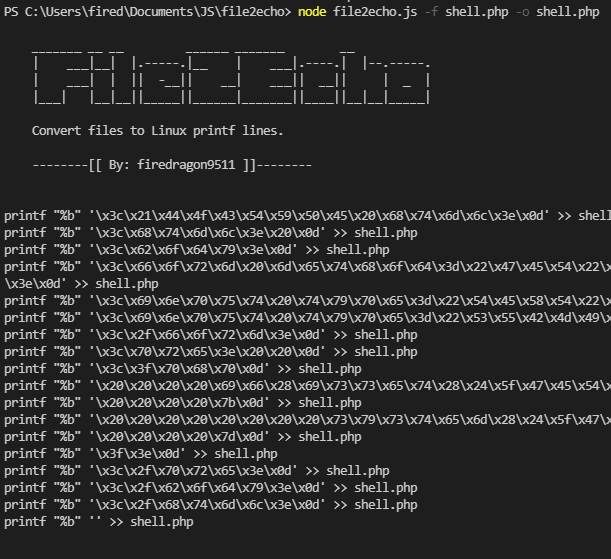

        _______ __ __         ______ _______        __
        |    ___|__|  |.-----.|__    |    ___|.----.|  |--.-----.
        |    ___|  |  ||  -__||    __|    ___||  __||     |  _  |
        |___|   |__|__||_____||______|_______||____||__|__|_____|

        Convert files to Linux printf lines.

        --------[[ By: firedragon9511 ]]--------

    Usage:
            node file2echo.js -f [FILE] [OPTIONS]

    Options:

            -h              Help
            -f              Specify the file
            -o              Output file name. Default: "file.bin"
            -m              Mode. Ex.: oneline, onequote, default

